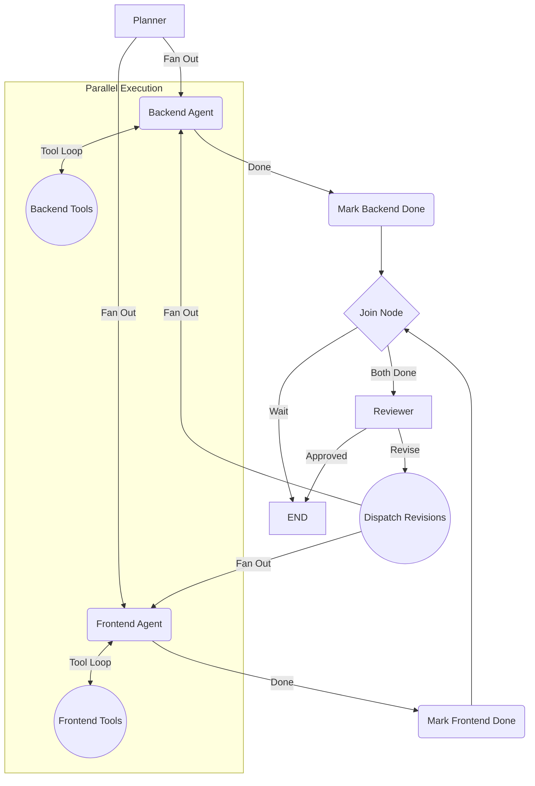

# Multi-Agent Software Development Team

## Project Overview

The Multi-Agent Software Development Team is an autonomous, AI-driven framework that simulates a professional software engineering team. By leveraging LangGraph and specialized Large Language Models (LLMs), the system automates the software development lifecycle from requirements planning to code generation, parallel execution, and automated code review.

The framework decomposes user requirements into discrete tasks, delegates them to specialized Frontend and Backend agents operating in parallel, and ensures code quality via a dedicated Reviewer agent that enforces a rigorous revision cycle.

## Problem Statement

Traditional AI coding assistants often operate as single, sequential agents that struggle to maintain context over large codebases or manage the separation of concerns between different technical domains (e.g., frontend UX vs. backend APIs). Sequential generation also leads to slower execution times and architectural coupling. This project solves these issues by introducing an orchestrated, multi-agent state machine that enforces parallel execution, domain specialization, and strict quality assurance through automated peer review.

## Features

- **Autonomous Planning**: Dynamically decomposes high-level user requirements into distinct frontend and backend task lists.
- **Parallel Agent Execution**: Frontend and Backend developer agents operate concurrently, significantly reducing code generation time and isolating domain logic.
- **Domain Specialization**: Agents use tailored system prompts to focus strictly on their area of expertise (e.g., UI/UX vs. databases/performance).
- **Automated Peer Review**: A dedicated Reviewer agent evaluates the combined workspace, identifying issues and dispatching targeted feedback to the responsible agents.
- **Self-Healing Revision Cycles**: Agents autonomously rewrite and correct their code based on targeted feedback until the Reviewer approves the implementation or a maximum revision limit is reached.
- **File System Integration**: Agents natively write code to disk within an isolated workspace directory using strict tool binding.

## System Architecture

The core of the system is a directed acyclic graph (DAG) built with **LangGraph**. The workflow enforces state synchronization and parallel fan-out/fan-in routing.



### State Management
The system utilizes a central `AgentState` dictionary using LangGraph `Annotated` reducers to ensure thread-safe message logging across parallel nodes. Communication history is strictly isolated (`backend_messages` and `frontend_messages`) to prevent LLM hallucination and ensure clear context boundaries.

## Technology Stack

- **Python 3.12+**: Core programming language.
- **LangGraph**: Framework for orchestrating the multi-agent state machine and cyclic workflows.
- **LangChain Core**: Standardized interfaces for messages, tools, and LLM interactions.
- **LangChain Google GenAI**: Integration for Google's Gemini models (`gemini-3.5-flash`).
- **Pytest**: Automated testing framework for unit and integration verification.

## Project Structure

```text
.
├── AGENTS_DOCUMENTATION.md    # Detailed documentation of agent behavior
├── AGENT_STATE_DOCS.md        # State schema documentation
├── plan-phases.md             # Project milestones and roadmap
├── src/
│   ├── agents/                # LLM Agent definitions
│   │   ├── backend_agent.py   # Backend code generation
│   │   ├── frontend_agent.py  # Frontend code generation
│   │   ├── planner.py         # Task decomposition
│   │   └── reviewer.py        # Code evaluation and feedback
│   ├── graph/                 # LangGraph configuration
│   │   └── workflow.py        # DAG routing and edge definitions
│   ├── tools/                 # Agent tools
│   │   └── file_tools.py      # File system operations (write_code_to_disk)
│   ├── main.py                # Application entry point
│   └── state.py               # AgentState TypedDict definition
├── tests/                     # Test suite
│   ├── test_agents.py         # Unit tests for individual agents
│   ├── test_integration.py    # End-to-end parallel workflow tests
│   └── test_workflow.py       # LangGraph routing logic tests
└── workspace/                 # Target directory for generated code
```

## Installation Instructions

1. **Clone the repository:**
   ```bash
   git clone <repository_url>
   cd Multi-agent-Project
   ```

2. **Create and activate a virtual environment:**
   ```bash
   python -m venv venv
   source venv/bin/activate  # On Windows use: venv\Scripts\activate
   ```

3. **Install dependencies:**
   ```bash
   pip install -r requirements.txt
   ```
   *(Note: Ensure `langchain-google-genai`, `langgraph`, and `pytest` are installed).*

## Configuration and Environment Variables

The system relies on Google's Gemini API for inference. You must configure your API key before running the workflow.

Create a `.env` file in the root directory:
```env
GOOGLE_API_KEY=your_gemini_api_key_here
```

The application uses `python-dotenv` to automatically load these variables at runtime.

## Usage Guide

To execute the multi-agent workflow, simply run the main entry point:

```bash
python src/main.py
```

The default configuration in `src/main.py` is set to generate a library management web app with a FastAPI backend and an HTML frontend. You can modify the `"requirements"` string inside `main.py` to prompt the agents to build any software you desire.

All generated code will be automatically written to the `./workspace/` directory.

## Testing Instructions

The project maintains a rigorous test suite covering agent behavior, graph routing, and end-to-end integration (including mocked parallel execution).

To run the test suite:
```bash
pytest
```

To run tests with verbose output and immediate traceback:
```bash
pytest -v --tb=short
```

## Workflow Execution Example

**Input Requirement:**
> "Build a simple library management web app. Create a backend API with FastAPI (api.py) and a frontend HTML file (index.html) that fetches from the API."

**System Output Log:**
1. **[PLANNER]** parses requirements and generates separated task lists.
2. **[BACKEND]** & **[FRONTEND]** wake up in parallel.
3. Backend triggers `write_code_to_disk` to create `workspace/api.py`.
4. Frontend triggers `write_code_to_disk` to create `workspace/index.html`.
5. Both agents reach the synchronization barrier (`join_node`).
6. **[REVIEWER]** reads the workspace. If issues are found, it outputs:
   `"[BACKEND] Missing CORS middleware in FastAPI app."`
7. The revision is dispatched. Because the feedback is tagged `[BACKEND]`, the frontend agent sleeps, and the backend agent automatically applies the fix.
8. The system terminates when the Reviewer approves the code.
