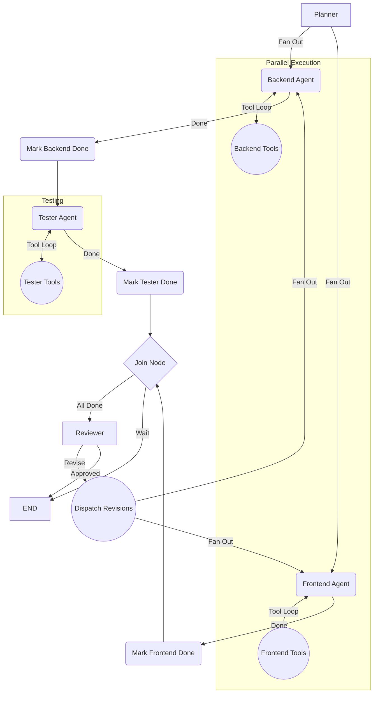

# Multi-Agent Software Development Team

An autonomous, AI-driven framework leveraging LangGraph and LLMs to simulate a professional software engineering team. It automates the software development lifecycle from planning to code generation and peer review.

**Cloud & Container Technologies Used:**

### AWS Services
- **AWS Lambda**: Used for serverless code execution. Its purpose is to run the multi-agent system and the generated codebase without provisioning or managing servers, enabling a scalable and ephemeral environment.
- **Amazon S3**: Used for persistent artifact storage. Its purpose is to maintain a durable, real-time backup of the generated codebase, mitigating the ephemeral nature of Lambda's `/tmp` directory.
- **AWS SAM (Serverless Application Model)**: Used for Infrastructure as Code (IaC). Its purpose is to define, provision, and deploy the required AWS resources (Lambda, S3, API Gateway) seamlessly using the included templates.

### Containerization
- **Docker**
- **Docker Compose**

## Features

- **Autonomous Planning**: Decomposes user requirements into frontend and backend tasks.
- **Parallel Agent Execution**: Frontend and Backend agents operate concurrently to reduce execution time.
- **Automated Peer Review**: A Reviewer agent evaluates the workspace and dispatches targeted feedback.
- **Self-Healing Revisions**: Agents autonomously rewrite code based on feedback.
- **AWS Cloud Integration**: Natively supports AWS Lambda deployments, persisting artifacts to Amazon S3. See [AWS_FEATURES.md](./AWS_FEATURES.md) for details.
- **Docker Support**: Easy local orchestration for frontend and backend via `docker-compose`.

## System Architecture



## Technology Stack

- **Python 3.12+**: Core programming language.
- **LangGraph**: Framework for orchestrating the multi-agent state machine and cyclic workflows.
- **LangChain Core**: Standardized interfaces for messages, tools, and LLM interactions.
- **LangChain Groq**: Integration for Groq's fast inference models (currently utilizing `llama-3.3-70b-versatile`).
- **AWS Boto3**: Enables programmatic interaction with Amazon S3 for cloud object storage and artifact persistence.
- **Pytest**: Automated testing framework for unit and integration verification.
- **FastAPI**: Backend server to stream LangGraph execution events and provide workspace access.
- **React & Vite**: Modern frontend dashboard for real-time visualization of agent execution and workspace inspection.

## Project Structure

```text
.
├── frontend/                  # React + Vite dashboard UI
├── src/
│   ├── agents/                # LLM Agent definitions (planner, frontend, backend, tester, reviewer)
│   ├── graph/                 # LangGraph routing and configuration
│   ├── tools/                 # Agent tools (aws_tools, exec_tools, file_tools)
│   └── server.py              # FastAPI server for dashboard streaming
├── tests/                     # Automated test suite
└── workspace/                 # Target directory for generated code
```

## AWS Integration

When `DEPLOYMENT_ENV` is set to `AWS`, the system seamlessly adapts to serverless constraints. It swaps local file writes with `write_code_to_s3` to dual-write artifacts to `/tmp/workspace` (for execution) and Amazon S3 (for persistence), and natively runs Pytest suites within the Lambda execution environment. For full details, see [AWS_FEATURES.md](./AWS_FEATURES.md).

## Running the Application

Before running, ensure you have your environment variables set in a `.env` file at the root:
```env
GROQ_API_KEY=your_groq_api_key_here
DEPLOYMENT_ENV=local # Set to 'AWS' for cloud features
S3_WORKSPACE_BUCKET=your-bucket-name
```

### Using Docker (Recommended)
You can quickly bring up the entire stack using Docker Compose:
```bash
docker compose up --build
```
- **Frontend Dashboard:** `http://localhost:80`
- **Backend API:** `http://localhost:8080`

### Running Locally (Without Docker)

1. **Install dependencies:**
   ```bash
   python -m venv venv
   source venv/bin/activate
   pip install -r requirements.txt
   
   cd frontend
   npm install
   ```

2. **Start the servers:**
   - **Backend**: `fastapi run src/server.py --port 8000` (from root)
   - **Frontend**: `npm run dev` (from `frontend/`)
   
Alternatively, run the agent workflow directly via CLI:
```bash
python src/main.py
```
